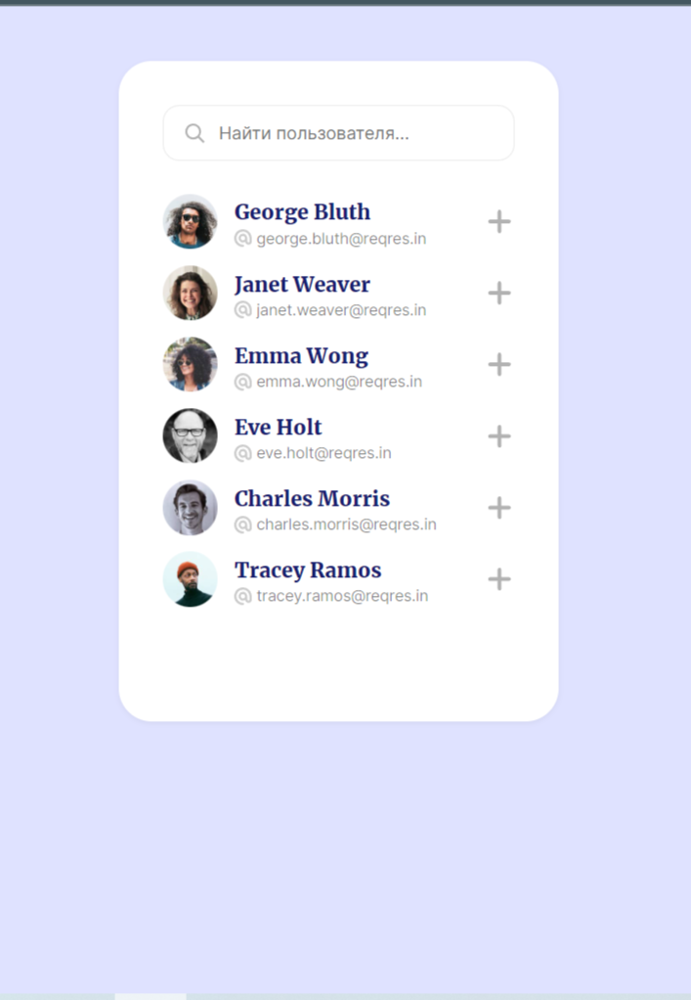

Список пользователей.   

В данном проекте реализовано     
1. Обращение к api за списком пользователей.    
2. Живой поиск пользователей по имени и почте.    
3. Выбор пользователей на отправку приглашения.    
4. Уведомление, что конкретному числу пользователей успешно отправлено приглашение.